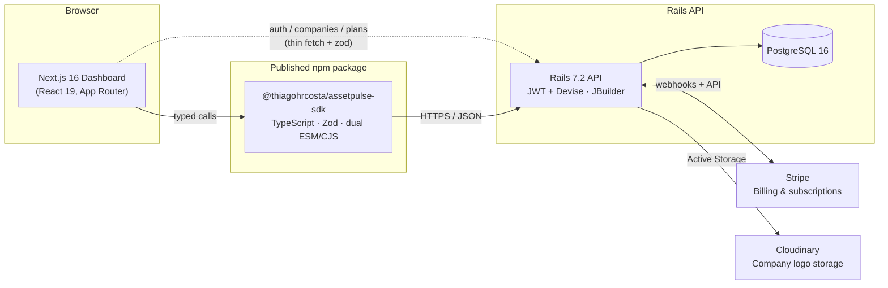

# AssetPulse


**Fleet & parts lifecycle management, built end-to-end: Rails API, Next.js
dashboard, and a published TypeScript SDK that ties them together.**

[](https://rubyonrails.org/)
[](https://nextjs.org/)
[](https://react.dev/)
[](https://www.typescriptlang.org/)
[](https://www.postgresql.org/)
[](https://stripe.com/)
[](https://www.docker.com/)
[](https://www.npmjs.com/package/@thiagohrcosta/assetpulse-sdk)
[](LICENSE)

---

## Overview

AssetPulse is a B2B SaaS platform for fleet operators and repair shops to
track physical parts through their entire lifecycle — from installation on
a vehicle, through maintenance and reassignment, to replacement or scrap —
instead of losing that history in spreadsheets.

It's built as a **real, multi-repo product**, not a toy CRUD demo:

- A **Ruby on Rails API** that owns the domain, authentication, and Stripe
  billing.
- A **Next.js dashboard** that companies use day to day.
- A standalone, **published npm package** — `@thiagohrcosta/assetpulse-sdk`
  — that wraps the API in a typed, validated client and is versioned/tested
  independently of the app that consumes it.

The three pieces are deliberately decoupled: the API doesn't know the web
app exists, the web app talks to the API exclusively through the SDK (or a
thin fetch layer for endpoints the SDK doesn't cover yet), and the SDK ships
on its own release cadence to npm. That separation is the part of this
project worth looking at closely — it's the same shape as how a real
platform team splits a backend, a frontend, and a client library.

## Why it exists

Every part that goes into a vehicle has a story: when it was installed, how
old it was when it failed, whether it was factory-original or aftermarket,
which shop touched it last. Fleet operators need that history to make
decisions (warranty claims, preventive maintenance, vendor quality) and
today it mostly doesn't exist anywhere queryable. AssetPulse models that
history as an **append-only lifecycle event log** per part, keyed off a
denormalized "current status" for fast reads — the kind of trade-off a
production system actually has to make.

## Architecture



**Why an SDK instead of the frontend calling the API directly?** Three
resources — host units, parts, and lifecycle events — are the actual
product surface and are consumed from more than one place over time (the
dashboard today, potentially a CLI or a second client tomorrow). Pulling
their request shape, validation, and error handling into a dependency
published to npm means that contract is versioned, unit-tested, and typed
independently of any one frontend. Auth, companies, and billing stayed as
thin fetch calls in the web app because they're truly single-consumer.

## Tech Stack

### Backend — `asset-pulse-api`

| Layer | Technology |
|---|---|
| Framework | Ruby on Rails 7.2 (API mode) |
| Language | Ruby 3.1 |
| Database | PostgreSQL 16 |
| Auth | Devise + JWT (stateless bearer-token auth) |
| Billing | Stripe (subscriptions, checkout sessions, billing portal, webhooks) |
| File storage | Active Storage → Cloudinary (company logos) |
| API docs | rswag (Swagger UI + OpenAPI spec) |
| Testing | RSpec, FactoryBot, Faker, Shoulda Matchers, SimpleCov (90% min. line coverage gate) |
| Static analysis | Brakeman (security), RuboCop Omakase (style), `bundler-audit` / `importmap audit` |
| CI | GitHub Actions — lint, security scan, and full test suite on every PR |
| Deploy | Docker, multi-stage production image, Kamal-ready |

### Frontend — `asset-pulse-web`

| Layer | Technology |
|---|---|
| Framework | Next.js 16 (App Router) |
| UI library | React 19 |
| Language | TypeScript (strict) |
| Styling | Tailwind CSS 4 |
| Validation | Zod (shared schemas for API responses) |
| API client | `@thiagohrcosta/assetpulse-sdk` for parts/host units/lifecycle events; typed `fetch` layer for auth, companies, plans, and subscriptions |
| Auth state | React context backed by `localStorage`, synced across tabs via `useSyncExternalStore` |
| Linting | ESLint (`eslint-config-next`) |

### The SDK — `@thiagohrcosta/assetpulse-sdk`

| Layer | Technology |
|---|---|
| Language | TypeScript (strict) |
| Validation | Zod schemas mirroring the API's actual `NOT NULL` constraints |
| Build | tsup — dual ESM/CJS output with bundled type declarations |
| Testing | Vitest |
| Runtime deps | Zero — only peer-depends on Zod |
| Distribution | Published to npm, semantically versioned, own CI/release pipeline |

### Infrastructure

Docker Compose orchestrates all three services locally — `db` (Postgres),
`api` (Rails, hot-reloaded via bind mount), and `web` (Next.js, hot-reloaded
via bind mount) — so the whole stack comes up with one command and no local
Ruby/Node install required.

## The SDK

`@thiagohrcosta/assetpulse-sdk` is a **standalone package with its own
repository, versioning, and release process** — the frontend consumes it
like any third-party dependency, which is the point.

- 📦 npm: [npmjs.com/package/@thiagohrcosta/assetpulse-sdk](https://www.npmjs.com/package/@thiagohrcosta/assetpulse-sdk)
- 💻 Source: [github.com/thiagohrcosta/assetpulse-sdk](https://github.com/thiagohrcosta/assetpulse-sdk)

```bash
npm install @thiagohrcosta/assetpulse-sdk
```

```ts
import { AssetPulseClient } from "@thiagohrcosta/assetpulse-sdk";

const client = new AssetPulseClient({ token, companyId });

const parts = await client.parts.list({ status: "installed" });

await client.lifecycleEvents.create(partId, {
  event_type: "replaced_wear",
  occurred_at: new Date().toISOString(),
  age_at_event_days: 412,
});
```

It resolves the API base URL automatically (localhost in dev,
`ASSETPULSE_API_URL` / `NEXT_PUBLIC_ASSETPULSE_API_URL` in other
environments), validates request payloads with Zod *before* they hit the
network, and normalizes every failure mode into a single
`AssetPulseApiError` — so the app in `asset-pulse-web/lib/asset-pulse-client.ts`
stays a thin, dependency-injected factory instead of hand-rolled fetch code.

## Domain model

| Entity | Purpose |
|---|---|
| **User** | Devise-authenticated account; `user`, `company_admin`, or `admin` access level |
| **Company** | A fleet operator or repair shop; owns host units, parts, and one subscription |
| **HostUnit** | A vehicle or piece of equipment (unique VIN) that parts get installed on |
| **Part** | A single serialized part with a denormalized `status` (installed / in_repair / removed / scrapped) |
| **LifecycleEvent** | Append-only history entry for a part (installed, maintenance, replaced, reassigned, scrapped) — the source of truth `Part#status` is cached from |
| **Plan** / **Subscription** | Stripe-backed billing tiers; supports a 7-day card-less trial before any Stripe subscription exists |

## Getting started

```bash
git clone <this repo>
cd AssetPulse
cp .env.example .env   # defaults already work locally
docker compose up --build
```

| Service | URL |
|---|---|
| Web dashboard | http://localhost:3001 |
| API | http://localhost:3000 |
| API health check | http://localhost:3000/up |
| Swagger UI | http://localhost:3000/api-docs |
| Postgres | localhost:5432 |

The API code is bind-mounted into the container, so changes on the host
reflect immediately — no rebuild needed unless the `Gemfile` changes
(`docker compose build api`). On first boot, `docker-entrypoint` runs
`db:prepare` automatically (creates the database and applies migrations).

### Useful commands

```bash
docker compose logs -f api          # tail API logs
docker compose exec api bin/rails c # Rails console
docker compose exec api bin/rails db:migrate
docker compose down                 # stop everything (keeps volumes)
docker compose down -v              # stop and wipe volumes (full reset)
```

## Testing

Backend suite runs in RSpec against the same `db` service the compose stack
already provides:

```bash
docker compose up -d db api
docker compose exec -e RAILS_ENV=test api bin/rails db:prepare   # first run / after new migrations
docker compose exec -e RAILS_ENV=test api bundle exec rspec
```

SimpleCov fails the run (exit 2) if line coverage drops below **90%**
(configured in [asset-pulse-api/spec/rails_helper.rb](asset-pulse-api/spec/rails_helper.rb));
the HTML report lands in `asset-pulse-api/coverage/index.html`. The same
checks — lint, security scan, and the full suite — run on every pull
request via GitHub Actions.

## API documentation

The full REST contract is documented with OpenAPI and served through
Swagger UI at [`/api-docs`](http://localhost:3000/api-docs) once the API is
running, covering auth, companies, host units, parts, lifecycle events,
plans, and subscription/billing endpoints.

## Project structure

```
.
├── docker-compose.yml        # orchestrates db + api + web
├── .env.example               # shared environment variables
├── asset-pulse-api/           # backend — Rails API
│   ├── app/
│   │   ├── controllers/api/v1/  # auth, companies, host_units, parts, lifecycle_events, subscriptions
│   │   ├── models/               # User, Company, HostUnit, Part, LifecycleEvent, Plan, Subscription
│   │   └── services/             # Stripe plan sync, subscription webhook handling
│   ├── spec/                  # RSpec suite (models, requests, services)
│   ├── swagger/v1/            # OpenAPI spec served by rswag
│   ├── Dockerfile              # production image (Kamal-ready)
│   └── Dockerfile.dev           # development image (used by compose)
└── asset-pulse-web/           # frontend — Next.js dashboard
    ├── app/                    # App Router pages (dashboard, parts, billing, auth)
    ├── components/             # shared UI + ProtectedRoute
    ├── context/                # AuthContext (token/session state)
    └── lib/
        ├── api.ts                # typed fetch layer (auth, companies, plans, subscriptions)
        ├── asset-pulse-client.ts # factory around @thiagohrcosta/assetpulse-sdk
        └── schemas.ts            # Zod schemas shared with the API contract
```

## Author

Built by [**Thiago Costa**](https://github.com/thiagohrcosta) — backend,
frontend, and the SDK, end to end.

## License

[MIT](LICENSE)
